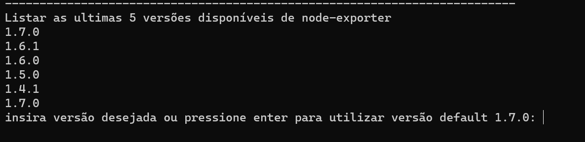
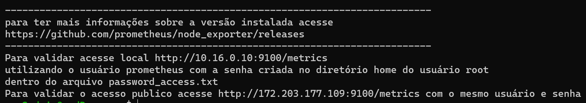

# SCRIPT PARA INSTALAR NODE EXPORTER EM LINUX
Objetivo deste script e automatizar o processo de instalação do agente node exporter para vm linux.
## Etapas do script
* Validar e instalar dependências
* Verificar versões disponíveis e listar 
* Realizar o download e instalação
* Criar uma senha de acesso e usuário para o node export
* Criar serviço de inicialização padrão SystemD e ativar para sempre iniciar caso a vm seja reiniciada
* Verificar se aplicação está ativa e mostrar como conectar e onde encontrar senha de acesso.

## Interações
O script irá solicitar que seja escolhido a versão, com base nas ultimas versões disponíveis mostrada, ou irá instalar a versão default.
## Instalação
* Baixe o script por aqui **[Instal_node_Exporter.sh](https://dev.azure.com/way2/DEVOPS-OPERATIONS/_git/devops-scripts?path=/observability/prometheus)**
* Atribua permissão para executar 
  *  *chmod guo+x install_nodeExporter.sh*
* Executar o script como sudo pois irá realizar alguns processos que apenas o root pode realizar 
  * *sudo /bin/bash install_nodeExporter.sh*
  * **Desconsiderar o alerta abaixo**
  > WARNING: apt does not have a stable CLI interface. Use with caution in scripts.

* Escolher a versão do node exporter 
   
  
* Mensagem no final da instalação
  * 
  
## Arquivos criados após a instalação
  * Criado o service do systemD com nome:
    * *node_exporter.service*
  * Criado arquivo de autenticação do prometheus em:
    * */etc/prometheus_node_exporter/configuration.yml*
  * Criado o arquivo de senha no home do root com nome:
    * *password_access.txt*

## Fontes
Este script foi construído utilizando com base a documentação de instalação do *stackhero for prometheus, documentação oficial do prometheus e seu github,* segue seus links abaixo:
* [www.stackhero.io](https://www.stackhero.io/en/services/Prometheus/documentations/Using-Node-Exporter#what-is-prometheus-node-exporter)
* [prometheus.io](https://prometheus.io/docs/guides/node-exporter/)
* [github-prometheus](https://github.com/prometheus/node_exporter)
